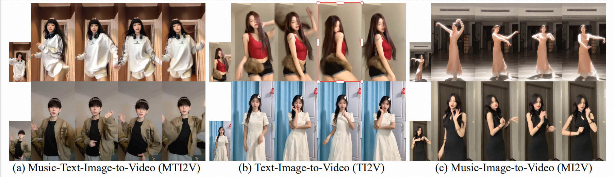

<p align="center">
  <h1 align="center">🎵 OmniDance</h1>
  <h3 align="center">OmniDance: Multimodal Driven Dance Video Generation with Large-scale Internet Data</h3>
  <p align="center">
      Kaixing Yang<sup>1</sup> ·
      Jiashu Zhu<sup>2</sup> ·
      Xulong Tang<sup>5</sup> ·
      Ziqiao Peng<sup>1</sup> ·
      Xiangyue Zhang<sup>4</sup>
      Chubin Chen<sup>3</sup>
      <br>
      Puwei Wang<sup>1*</sup> ·
      Jiahong Wu<sup>2*</sup> ·
      Xiangxiang Chu<sup>2</sup> ·
      Hongyan Liu<sup>3*</sup> ·
      Jun He<sup>1*</sup>
      <br><br>
      <sup>1</sup>Renmin University of China &nbsp;
      <sup>2</sup>AMap, Alibaba &nbsp;
      <sup>3</sup>Tsinghua University &nbsp;
      <sup>4</sup>Wuhan University &nbsp;
      <sup>5</sup>Malou Tech Inc
  </p>
<div align="center">

[](https://huggingface.co/datasets/GD-ML/OmniDance)
[](https://huggingface.co/GD-ML/OmniDance)
[](#)

</div>

<p align="center">
  
</p>
</p>

---

## ✨ Overview

OmniDance is designed for **controllable dance video generation** under multiple conditioning settings:

- 📝 **TI2V**: Text-Image-to-Video  
- 🎵 **MI2V**: Music-Image-to-Video  
- 📝🎵 **MTI2V**: Music-Text-Image-to-Video  

Given a reference image, OmniDance can synthesize dance videos that aim to preserve:

- 🧍 **Identity consistency**
- 🎬 **Temporal coherence**
- 🎨 **Visual fidelity**
- 💃 **Dance expressiveness**


---

## 📦 Repository Structure

The repository is organized as follows:

```bash
OmniDance/
├── diffsynth/        # Core generation / diffusion-related code
├── examples/        # Example inputs, scripts, and demo assets
├── model/           # Model configs / checkpoints placement directory
├── output/          # Generated videos and intermediate results
├── data/            # Prepared dataset assets (videos, audio, embeddings, images) + metadata CSV
├── metadata_test.csv  # (optional) metadata file for the test subset / inference input
├── order.sh         # Running script / command helper
├── teaser.png       # (optional) teaser image used in README
├── requirements.txt # Python dependencies
└── Readme.md        # Project documentation
```
---

## 🔗 Dataset

We release **OmniDance** on Hugging Face to support research on **multimodal driven dance video generation**. The dataset is built from **large-scale internet-sourced dance videos**.

### 🧠 Data Collection & Quality Filtering

To handle the noise of web-crawled data, OmniDance is constructed using a **progressive easy-to-hard expert pipeline**:

1. **Popular creator mining** to collect reliable public dance content.
2. **Visual quality verification** to remove low-quality clips and heavy artifacts.
3. **Reference clarity verification** to ensure the reference frame has a visible dancer.
4. **Dance video verification** to filter non-dance or ambiguous motion content.
5. **Single-dancer filtering** to exclude group/duet and common mirror/overlay artifacts.
6. **Scene stability filtering** to remove clips with abrupt transitions or aggressive camera motion.

This pipeline yields a dataset that is cleaner and better suited for training controllable video generation models.

### 📝 Annotation: Choreography-Informed Text

For each clip, we provide a caption describing the choreography from multiple complementary aspects, including:

1. **Body Dynamics** (moment-to-moment actions and mechanics)  
2. **Choreographic Content** (genre/style and movement vocabulary)  
3. **Expressiveness** (emotion, energy, and performance intent)  
4. **Camera Presentation** (framing and camera style)  
5. **Overall Look** (appearance and environment context)

The annotations are designed to support both **semantic intent control** (text) and **rhythm/temporal dynamics learning** (music).

### 🌍 Coverage

CIPE-Dance covers diverse and realistic variations, such as:

- **Over 30 dance genres** with long-tailed distribution
- **Multiple environments** (studios, stages, streets, and home settings)
- **Performer diversity** (appearance and performance styles)
- **Motion complexity** (from groove patterns to jumps and fast limb articulation)
- **Camera variability** with stable-video filtering applied

### ✅ Dataset Link

👉 **Dataset:** https://huggingface.co/datasets/GD-ML/OmniDance

For the latest details (e.g., file structure, splits, and fields), please refer to the dataset page.

---

## 📌 Notes

1. OmniDance is built upon WAN-TI2V-5B, whose VAE is relatively compressed. As a result, the learned representation may be less attentive to fine-grained person details (e.g., hands and face). For follow-up work in dance generation—where high-frequency visual cues are particularly important—we suggest using a stronger 14B-scale model (or similar) as a starting point.

2. We observe that the original internet-collected dataset may contain some local blur introduced by recording device limitations. If you plan to incorporate our dataset into training, we recommend applying lightweight super-resolution / deblurring preprocessing to the training samples beforehand.

3. While OmniDance represents a meaningful advancement in this area, there is still a gap toward true commercial deployment. Therefore, we do not recommend using OmniDance directly as a base model for subsequent research targeting production-level systems.


If you find this project helpful, feel free to open an issue or contact the authors for collaboration and research discussion.

---

## ⭐ Citation

If you use OmniDance in your research, please consider citing the corresponding paper.

```bibtex
@article{omnidance2026,
  title={OmniDance: Multimodal Driven Dance Video Generation with Large-scale Internet Data},
  author={Anonymous or Authors},
  journal={ECCV},
  year={2026}
}
```
---